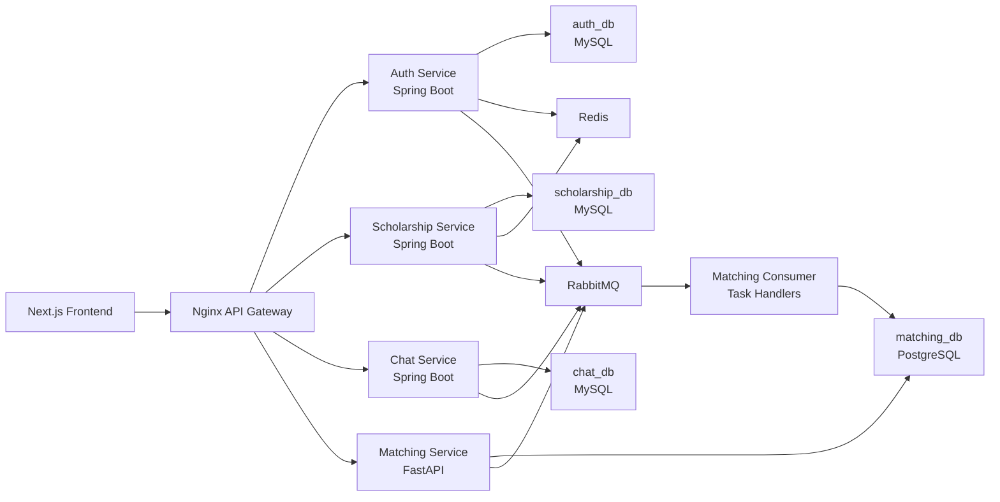

# EduMatch

EduMatch is a full-stack scholarship discovery and application platform. It lets students search scholarships, bookmark opportunities, submit applications, chat with providers, receive notifications, and view personalized scholarship recommendations.

The project is built as a multi-service system to practice backend architecture, API design, database modeling, asynchronous processing, and performance optimization beyond basic CRUD.

## Features

- JWT authentication with user roles: student, provider, and admin.
- Scholarship management for providers.
- Public scholarship search with filters, pagination, bookmarks, and applications.
- Application workflow with provider/admin status updates.
- Chat and notification services for user-provider communication.
- Admin dashboard for users, scholarships, applications, moderation, and analytics.
- Matching service for scholarship recommendations using rule-based scoring, batch score API, score cache, and precomputed recommendation cache.
- Docker Compose local environment with Nginx API gateway.
- GitHub Actions workflow prepared for Azure Container Apps deployment.

## Tech Stack

| Area | Technologies |
| --- | --- |
| Frontend | Next.js, React, TypeScript, Tailwind CSS, React Query |
| Backend | Java Spring Boot, FastAPI |
| Databases | MySQL, PostgreSQL, Redis |
| Messaging / Workers | RabbitMQ, inline matching consumers, Celery-compatible task handlers |
| Auth | JWT, role-based access control |
| Gateway / Infra | Nginx, Docker, Docker Compose |
| CI/CD | GitHub Actions, Azure Container Apps |

## Architecture



## Services

| Service | Port | Notes |
| --- | --- | --- |
| Frontend | `3000` | Next.js application |
| API Gateway | `19080` | Main local API entrypoint |
| Auth Service | `8081` | Login, users, roles, organizations |
| Scholarship Service | `8082` | Scholarships, applications, bookmarks, provider/admin dashboards |
| Matching Service | `8000` | Score and recommendation APIs |
| Chat Service | `8083` | REST APIs for chat/notifications |
| Chat WebSocket | `8084` | Realtime messaging |
| RabbitMQ UI | `15672` | Queue management UI |
| Redis | `6379` | Local cache |
| MySQL Auth DB | `3307` | `auth_db` |
| MySQL Scholarship DB | `3308` | `scholarship_db` |
| MySQL Chat DB | `3309` | `chat_db` |
| PostgreSQL Matching DB | `5432` | `matching_db` |

## Matching Service

The matching service is intentionally designed as a hybrid recommendation foundation rather than a direct LLM-on-request system.

Current matching flow:

1. Store applicant and opportunity features in PostgreSQL.
2. Apply hard filters such as GPA, public/approved status, deadline, and optional level/location/study mode when data is available.
3. Calculate rule-based score breakdown for skills, major, GPA, level, location/study mode, and opportunity boost.
4. Support batch scoring for scholarship cards.
5. Store applicant-opportunity scores in `matching_scores`.
6. Store top-N recommendations in `recommendation_cache`.
7. Use RabbitMQ consumer/event processing to refresh matching features and cached recommendations.

The project does not call an LLM in the hot path. If AI is added later, the intended use is offline profile parsing, skill normalization, embeddings, and cached explanations.

## Local Setup

### Requirements

- Docker Desktop
- Docker Compose
- PowerShell for seed scripts on Windows

### 1. Configure environment variables

Copy the example file:

```powershell
Copy-Item .env.example .env
```

Fill all required values in `.env`. Use local-only passwords and a long random JWT secret.

### 2. Start services

```powershell
docker compose up -d --build
```

For matching background workers:

```powershell
docker compose --profile workers up -d --build
```

### 3. Seed development data

```powershell
powershell -ExecutionPolicy Bypass -File .\scripts\seed-dev-data.ps1
```

Optional load-test seed:

```powershell
powershell -ExecutionPolicy Bypass -File .\scripts\seed-dev-data.ps1 -LoadTest
```

### 4. Open the app

- Frontend: `http://localhost:3000`
- API Gateway: `http://localhost:19080`
- RabbitMQ Management: `http://localhost:15672`

## Demo Accounts

Default password for seeded users:

```txt
admin123
```

Common accounts:

| Role | Login |
| --- | --- |
| Admin | `admin_test` or `admin.test@edumatch.dev` |
| Student | `student1` or `student1@edumatch.dev` |
| Student | `student2` or `student2@edumatch.dev` |
| Student | `student3` or `student3@edumatch.dev` |
| Provider | `teacher1` or `teacher1@edumatch.dev` |
| Provider | `teacher2` or `teacher2@edumatch.dev` |
| Provider | `mit_provider` |
| Provider | `stanford_provider` |
| Provider | `google_provider` |

## Useful Commands

View service status:

```powershell
docker compose ps
```

View logs:

```powershell
docker compose logs --tail=100 frontend api-gateway auth-service scholarship-service matching-service chat-service
```

Restart gateway after recreating services:

```powershell
docker compose restart api-gateway
```

Run matching-only seed:

```powershell
powershell -ExecutionPolicy Bypass -File .\scripts\seed-dev-data.ps1 -MatchingOnly
```

## Documentation

The documentation is organized as a MkDocs Material site. Markdown files remain
the source of truth, and the HTML site is generated from them.

Run locally:

```powershell
pip install -r requirements-docs.txt
mkdocs serve
```

Build static HTML:

```powershell
mkdocs build
```

Start at [`docs/index.md`](docs/index.md). The main sections are:

| Section | Purpose |
| --- | --- |
| Getting Started | local setup, environment variables, seed data |
| Architecture | service boundaries, data flow, matching design |
| API | contracts and standardization notes |
| Deployment | Docker, Azure Container Apps, CI/CD, secrets |
| Operations | runbooks, observability, QA, readiness |
| Performance | bottlenecks, benchmark plan, optimization reports |
| Decisions | architecture decision records |

## Project Status

This is a portfolio/MVP project, not a fully production-hardened platform.

Implemented:

- Multi-service backend with gateway routing.
- Auth, scholarship, application, bookmark, chat, notification, admin, and provider flows.
- Matching service with rule-based scoring, batch score API, and recommendation cache.
- Seed data for local testing and load-test scenarios.
- Docker Compose local environment, CI validation, and manual deployment workflow draft.

Known next steps:

- Add stricter schema migrations instead of relying on dev-time auto update and seed `ALTER TABLE`.
- Add versioned matching cache keys using profile/opportunity version fields.
- Expand matching worker triggers for profile, application, and bookmark changes.
- Add evaluation dataset and metrics such as `constraint_violation_rate`, `precision@10`, `ndcg@10`, p95 latency, and cache hit rate.
- Harden production secrets, observability, and cloud deployment settings.

## Security Notes

- Do not commit `.env`.
- Use `.env.example` as the only committed environment template.
- Rotate any local credentials that were accidentally exposed.
- Keep JWT secrets and cloud credentials in GitHub/Azure secrets for deployment.
- Set `APP_JWT_REQUIRE_RSA=true` in production-like environments once RSA keys are configured; local and test profiles may keep HS256.
