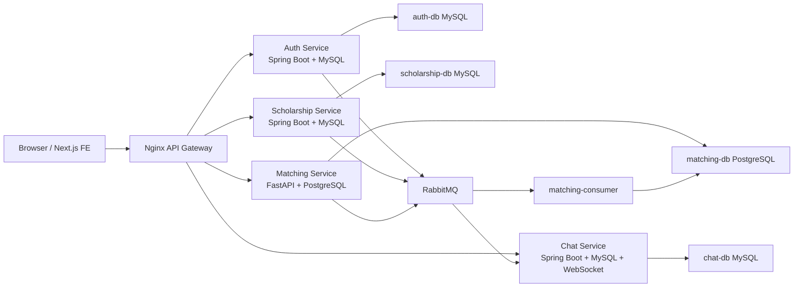

# System Architecture

## Architecture Goals

EduMatch should be optimized for:

- clear domain ownership
- safe auth boundaries
- predictable FE data flow
- fast read-heavy list pages
- async recommendation/matching workload
- easy local Docker operation
- upgrade path to production deploy

Non-goals for current phase:

- Kubernetes
- multi-region deployment
- realtime LLM scoring per request
- complex event streaming platform like Kafka

## High-Level Diagram



## Service Boundaries

### Frontend

Owns:

- routes/pages/layouts
- visual states
- form state
- client-side auth hydration
- React Query cache

Must not own:

- business validation as source of truth
- direct service URLs
- duplicate API clients
- production mock data

Allowed data fetching:

- Page/hook calls service modules.
- Service modules call `apiRequest`.
- `apiRequest` handles auth headers, gateway base URL, timeout.

### API Gateway

Owns:

- public external API entrypoint
- CORS/security headers
- route mapping
- gateway timeout/rate limiting
- websocket proxy

Must not own:

- business logic
- auth decision beyond coarse routing/rate limiting
- data transformation

Important local behavior:

- In Docker, Nginx resolves upstream names at startup.
- If backend containers are recreated, gateway may need recreate unless resolver is configured.

Target production improvement:

- Add Nginx `resolver 127.0.0.11 valid=10s;` for Docker DNS.
- Use variables for upstream to force runtime DNS resolution.

### Auth Service

Owns:

- users
- credentials/password auth
- JWT generation
- roles/authorities
- employer requests
- organization profile
- user profile fields used by matching

Should emit events:

- `user.registered`
- `user.profile.updated`
- `employer.request.approved`

Should expose internal read APIs:

- get user by username/email
- get user by id

Important improvement:

- JWT should include stable `userId`, email, roles.
- Other services should not call auth-service repeatedly if token already has required data.

### Scholarship Service

Owns:

- opportunities/scholarships
- applications
- bookmarks
- moderation
- scholarship stats

Should emit events:

- `scholarship.created`
- `scholarship.updated`
- `application.submitted`
- `application.status.changed`
- `bookmark.changed` if matching later uses bookmark signal

Important improvement:

- Application and bookmark duplicate protection must be DB constraints, not only code checks.
- Public scholarship list should be optimized for search/filter/pagination.

### Chat Service

Owns:

- conversations
- messages
- notification delivery
- websocket/STOMP endpoint
- optional FCM registration

Should consume events:

- notification events from scholarship and matching

Important improvement:

- Chat should degrade gracefully if Firebase is disabled locally.
- Realtime provider should not request permissions or connect websocket for public users/pages.

### Matching Service

Owns:

- matching score calculation
- matching score cache
- recommendation cache
- background precompute tasks
- matching eval scripts later

Should consume events:

- profile updated
- scholarship created/updated
- application/bookmark changes if used as signals

Should not:

- block scholarship creation
- full scan on every request
- call LLM per card/request

## Sync vs Async

### Sync Calls

Use sync HTTP when user needs immediate answer:

- login/register
- scholarship list/detail
- submit application
- bookmark toggle
- batch status lookup
- read cached recommendations

### Async Events

Use RabbitMQ/worker when work is heavy or non-critical:

- precompute recommendations
- send notification
- generate matching explanation
- analytics aggregation
- embedding generation

Tradeoff:

- Sync gives fresh data but can be slow.
- Async improves latency but introduces eventual consistency.
- For recommendations, eventual consistency is acceptable.
- For application submit, transaction consistency is required.

## Data Ownership

| Data | Source Of Truth | Read Model / Cache |
|---|---|---|
| User auth/roles | Auth DB | JWT claims |
| User profile matching fields | Auth DB | Matching snapshots/cache |
| Opportunity | Scholarship DB | Matching opportunity snapshot/cache |
| Application | Scholarship DB | Admin stats/read model |
| Bookmark | Scholarship DB | Matching signal/cache |
| Message | Chat DB | Realtime store |
| Matching score | Matching DB/cache | FE card score |
| Recommendation top-N | Matching DB recommendation_cache | FE recommendations |

## Why Microservices Here

Advantages:

- Matching can use Python/AI stack independently.
- Chat realtime can evolve independently.
- Auth/security boundary stays isolated.
- Scholarship transaction domain remains in Java/Spring.
- Services can scale differently later.

Costs:

- More Docker services.
- More debugging complexity.
- Network calls can fail.
- Consistent auth across services is harder.
- Need logs/request IDs.

Decision:

- Microservices are acceptable because matching/chat/auth have genuinely different concerns.
- To reduce complexity, keep gateway, Docker Compose, clear env, and docs strong.

## Gateway Routing Model

Expected routes:

```txt
/api/auth/**              -> auth-service:8081
/api/admin/**             -> auth-service and scholarship-service depending path
/api/user/**              -> auth-service
/api/employer/**          -> auth-service
/api/organizations/**     -> auth-service
/api/scholarships/**      -> scholarship-service:8082
/api/opportunities/**     -> scholarship-service:8082
/api/applications/**      -> scholarship-service:8082
/api/bookmarks/**         -> scholarship-service:8082
/api/chat/**              -> chat-service:8083
/api/conversations/**     -> chat-service:8083
/api/messages/**          -> chat-service:8083
/api/notifications/**     -> chat-service:8083
/api/v1/matching/**       -> matching-service:8000
/api/v1/recommendations/**-> matching-service:8000
/api/ws                   -> chat websocket
```

Actual Nginx config is the source of truth. This document describes target intent.

## Frontend Data Architecture

Target:

```txt
Page -> Hook -> Domain Service -> apiRequest -> Gateway
```

Example:

```txt
ScholarshipsPage
  useScholarships(apiFilters)
    scholarshipServiceApi.getScholarships()
      apiRequest("/api/scholarships?...") 
```

Avoid:

```txt
Component -> fetch("http://localhost:8082/...")
Component -> localStorage.getItem("auth_token")
Component -> mock-data
Component -> api-client old mock API
```

## Recommended Refactor Direction

### Phase 1: Stabilize Runtime

- Remove render loops.
- Remove public route auth spam.
- Stop global provider from fetching server data everywhere.
- Add fetch timeout/cancel.

### Phase 2: Standardize API Layer

- `api-config.ts` owns base URL, token headers, timeout.
- Domain services own endpoints.
- React Query hooks call domain services.

### Phase 3: Optimize Hot Paths

- Scholarship list server pagination/filter.
- Batch status/bookmark/matching.
- Matching recommendation cache.

### Phase 4: Production Readiness

- Request IDs.
- Error format.
- Logs and p95.
- Deployment guide and rollback.

## Architectural Tradeoffs

| Decision | Benefit | Cost | Current Recommendation |
|---|---|---|---|
| Spring Boot for auth/scholarship | Strong security/transaction ecosystem | Heavier runtime | Keep |
| FastAPI for matching | Python AI/data ecosystem | Cross-language ops | Keep |
| RabbitMQ worker | Async precompute | Eventual consistency/ops | Keep |
| Nginx gateway | Single external API | Gateway can be failure point | Keep, improve resolver |
| MySQL for auth/scholarship/chat | Familiar relational model | Multiple DB instances locally | Keep for now |
| Postgres for matching | Better for future vector/analytics | Another DB | Keep |
| React Query | Server state cache/invalidation | Query key discipline | Standardize |
| AppContext server data | Easy initially | Global fetch and stale state | Remove from server data |

## Architecture Review Questions

Use these before adding any new technology:

- What concrete bottleneck does it solve?
- Can batch/index/cache solve it first?
- How will we measure before/after?
- What new failure mode does it introduce?
- Can local Docker still run on a weak machine?
- What operational docs must be added?
- What test proves the change works?
