# EduMatch Data Flow

Tai lieu nay gom cac luong du lieu chinh cua EduMatch. Muc tieu la nhin vao biet request di qua service nao, DB nao, cho nao sync REST, cho nao async RabbitMQ/worker/WebSocket.

## 1. Tong Quan Sync Va Async

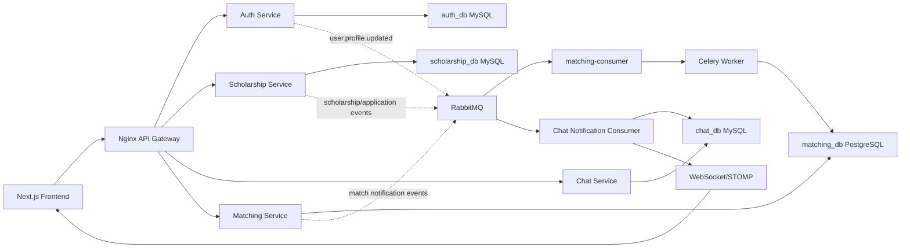

Nhan xet nhanh:

- Sync path: FE -> Gateway -> Service -> DB -> response.
- Async path: Service publish RabbitMQ event -> consumer/worker xu ly nen -> DB/cache/WebSocket.
- Matching va notification la hai phan async quan trong nhat.
- Chat realtime dung WebSocket, nhung van co HTTP fallback.

## 2. Login Va Lay Thong Tin User

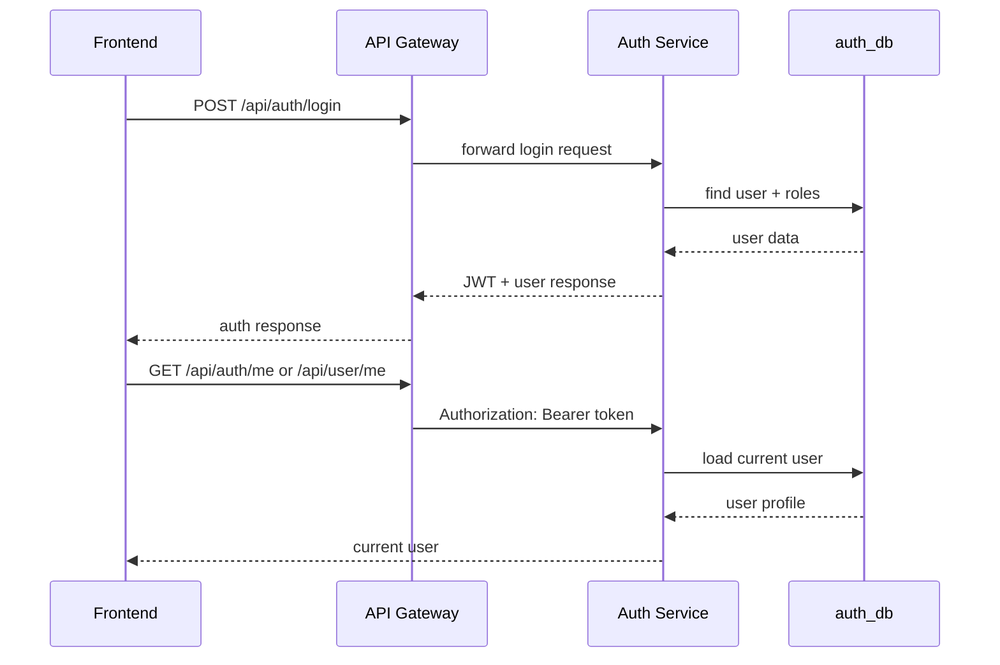

Ghi nho:

- Auth service la source of truth cho user, role, organization.
- Cac service khac dang goi Auth service sync de resolve user detail trong mot so luong.
- Nen toi uu tiep: dua `userId` vao JWT de bot goi Auth service o chat/notification.

## 3. User Update Profile -> Matching Async

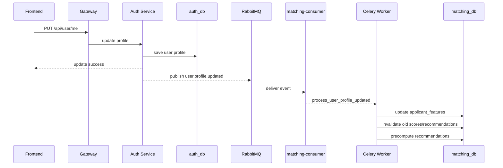

Consistency:

- Profile update thanh cong ngay khi Auth DB save xong.
- Recommendation co the tre vai giay vi chay async.
- Day la eventual consistency, khong phai bug neu recommendation chua doi lap tuc.

## 4. Public Scholarship Browse/Search

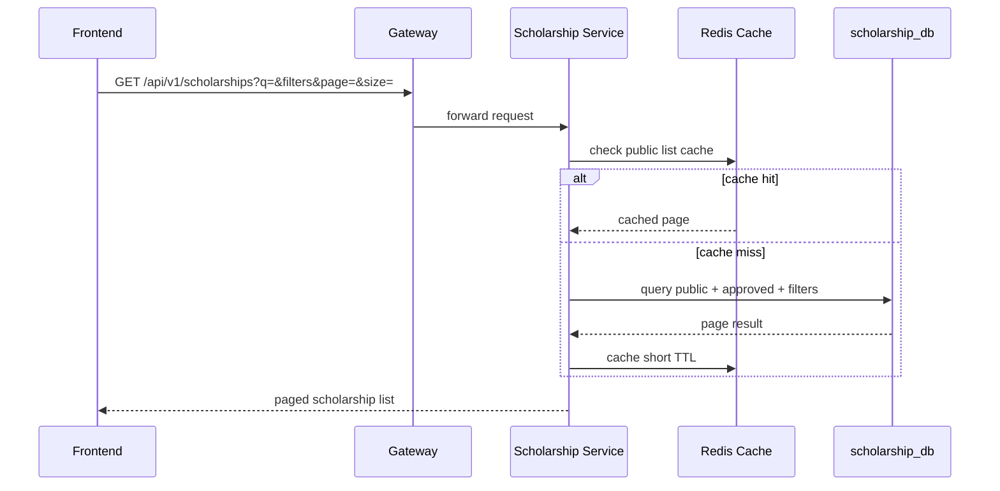

Ghi nho:

- Public list khong nen chua `matchScore`, `isBookmarked`, `hasApplied`.
- Du lieu personalized phai lay bang batch endpoint rieng neu user da login.
- Search keyword lon nen dung FULLTEXT/filter hybrid, khong dung `LIKE '%keyword%'`.

## 5. Authenticated Scholarship List With Batch Extras

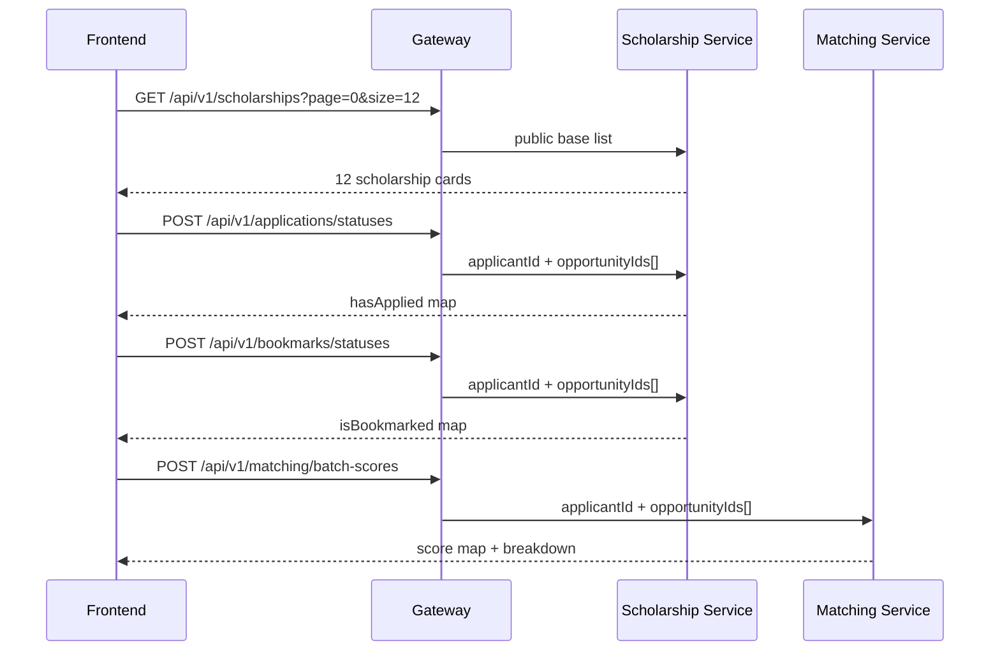

Ghi nho:

- Day la flow dung de tranh FE N+1.
- List 12 cards khong duoc goi 12 request score/bookmark/application rieng le.
- Matching batch nen doc `matching_scores` cache truoc, compute fallback neu can.

## 6. Student Apply Scholarship

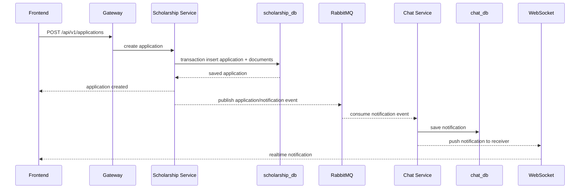

Consistency:

- Apply result phai strong consistent trong scholarship DB.
- Notification la async, co the den cham hon response apply.
- Can idempotency/unique constraint de chong double apply.

## 7. Provider Create/Update Scholarship

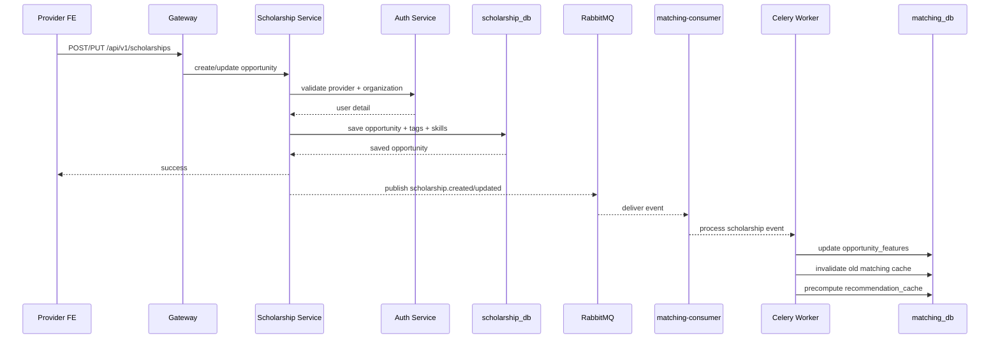

Ghi nho:

- Create/update scholarship khong nen doi matching tinh xong moi tra response.
- Matching refresh la side effect async.
- Neu RabbitMQ fail, can log/retry/DLQ de khong mat event.

## 8. Admin Moderate Scholarship

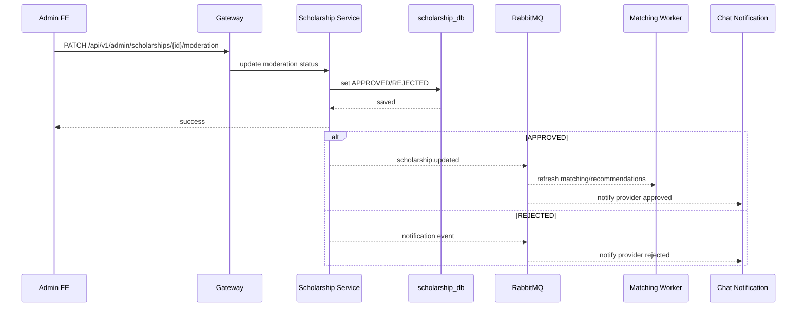

Ghi nho:

- Admin decision la sync write trong scholarship DB.
- Provider notification va matching refresh la async.
- Event naming hien tai co the con lan `scholarship.updated` voi notification payload; ve lau dai nen tach event ro hon.

## 9. Matching Recommendation Read Path

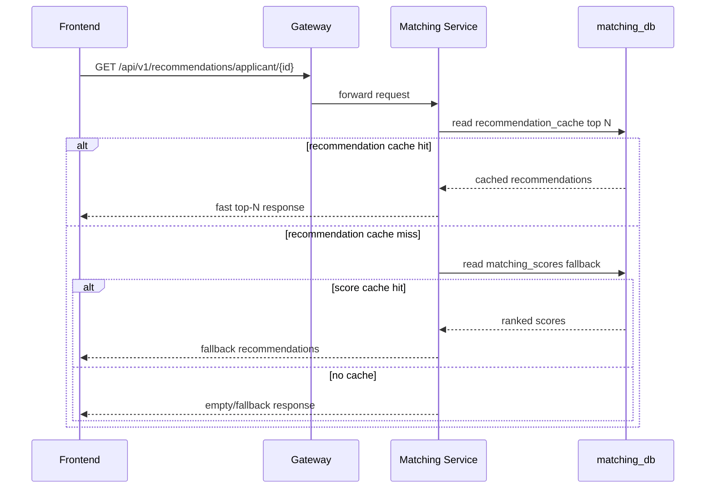

Ghi nho:

- Hot path khong nen full scan applicant x opportunity moi request.
- Worker la noi nen tinh nang; API la noi nen doc cache/read model.
- Neu them AI/vector sau nay, van nen chay offline/background truoc.

## 10. Chat Message Flow

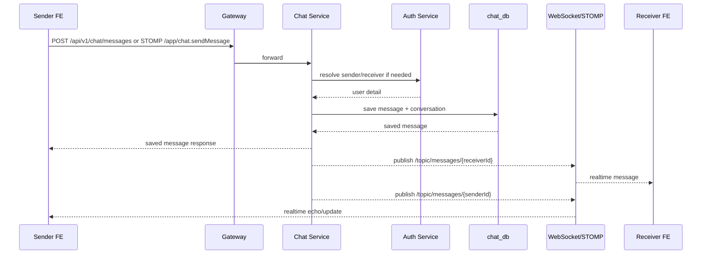

Ghi nho:

- Chat co ca WebSocket va HTTP fallback.
- WebSocket subscribe da check user chi subscribe topic cua chinh minh.
- Toi uu tiep: bot sync Auth call bang `userId` trong JWT.

## 11. Notification Feed Flow

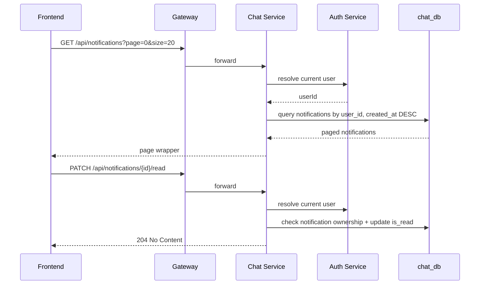

Ghi nho:

- Notification feed da co pagination cap va index `(user_id, created_at DESC)`.
- Khong nen public cache notification vi la private data.
- Toi uu tiep: atomic update `WHERE id=? AND user_id=?`, unread count, mark all read.

## 12. Consistency Cheat Sheet

| Flow | Sync/Async | Consistency |
| --- | --- | --- |
| Login | Sync REST | Strong after auth DB read |
| Update profile | Sync write + async matching | Profile strong, recommendations eventual |
| Public scholarship list | Sync read + Redis cache | Stale short TTL allowed |
| Apply scholarship | Sync DB write + async notification | Application strong, notification eventual |
| Create/update scholarship | Sync DB write + async matching | Opportunity strong, matching eventual |
| Admin moderation | Sync DB write + async matching/notification | Moderation strong, side effects eventual |
| Recommendation feed | Sync API read from read model | Eventual, depends on worker/cache |
| Chat message save | Sync DB write + realtime push | Message save strong, delivery best effort |
| Notification feed | Sync private read | Strong from chat DB |

## 13. Dieu Can Nho Khi Debug

1. FE loi UI/list cham: xem Network truoc, tim N+1 request.
2. API cham: xem service log + DB EXPLAIN.
3. Matching khong cap nhat: xem `matching-consumer`, `celery-worker`, RabbitMQ queue.
4. Notification khong hien realtime: xem Chat service, WebSocket subscribe, RabbitMQ notification event.
5. Data da write nhung read chua thay trong recommendation: co the do eventual consistency.
6. Cross-service call loi 503: xem Auth service, Redis cache, requestId trace.

