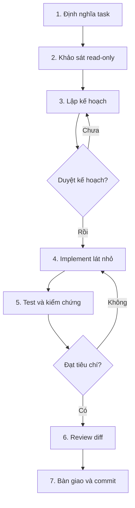

# Quy trình chuẩn dùng AI thực thi mã nguồn EduMatch

## 1. Mục tiêu

Quy trình này dùng khi giao cho AI khảo sát, sửa lỗi, phát triển tính năng,
refactor, viết test hoặc review mã nguồn EduMatch.

Mục tiêu không phải để AI tạo ra thật nhiều code. Mục tiêu là tạo ra một thay
đổi:

- đúng yêu cầu;
- đúng kiến trúc đang tồn tại;
- không vượt phạm vi;
- có bằng chứng kiểm thử;
- có thể review và hoàn tác;
- không làm yếu authentication, authorization hoặc an toàn dữ liệu.

Ba lớp bắt buộc:

| Lớp | Vai trò | Ví dụ trong EduMatch |
| --- | --- | --- |
| Ý định | Nói AI phải đạt kết quả gì | task, acceptance criteria, feature spec |
| Guardrail | Giới hạn cách AI được làm | `AGENTS.md`, API contract, kiến trúc |
| Bằng chứng | Chứng minh thay đổi đúng | test, build, lint, diff, kiểm tra runtime |

File Markdown chỉ giải quyết hai lớp đầu. Không có test hoặc kiểm tra thực tế thì
không được xem là hoàn thành.

## 2. Luồng tổng thể



Không bỏ bước khảo sát đối với repository chưa quen. Không bỏ bước duyệt kế
hoạch đối với thay đổi rủi ro cao.

## 3. Phân loại rủi ro trước khi làm

| Mức | Ví dụ | Cách thực thi |
| --- | --- | --- |
| Thấp | sửa text, style nhỏ, test độc lập, lỗi cục bộ rõ nguyên nhân | AI có thể khảo sát, sửa và kiểm tra trong một lượt |
| Trung bình | endpoint mới trong một service, thay business rule, refactor repository | bắt buộc trình bày kế hoạch file-level; có thể triển khai sau khi kế hoạch rõ nếu người dùng đã cho phép build |
| Cao | auth/authz, migration, API breaking change, RabbitMQ event, Nginx, secret, CI/CD, Azure, thay đổi nhiều service | AI dừng sau khảo sát và kế hoạch; con người duyệt rồi mới sửa |

Nếu một task thuộc nhiều mức, lấy mức cao nhất.

## 4. Giai đoạn 0 — Chuẩn bị vùng làm việc

### Việc cần làm

1. Làm việc trên branch hoặc worktree riêng.
2. Kiểm tra trạng thái Git trước khi sửa.
3. Ghi nhận các thay đổi có sẵn của người dùng; không ghi đè hoặc dọn chúng.
4. Xác định service và đường chạy có liên quan.
5. Không đưa `.env`, database dump thật hoặc secret vào prompt/tài liệu.

### Gate 0

Chỉ bắt đầu khi biết:

- repository/branch đang làm;
- những thay đổi hiện có cần giữ nguyên;
- phạm vi service dự kiến;
- thao tác nào cần xin phép trước.

### Prompt khởi động

```text
Đọc AGENTS.md và kiểm tra trạng thái repository.

Chưa sửa code. Hãy xác định:
1. Những instruction đang áp dụng.
2. Thay đổi có sẵn cần bảo toàn.
3. Service và tài liệu có khả năng liên quan.
4. Task này thuộc mức rủi ro thấp, trung bình hay cao, kèm lý do.
```

## 5. Giai đoạn 1 — Viết task có thể kiểm chứng

Mỗi task phải trả lời được bốn câu hỏi:

| Thành phần | Câu hỏi |
| --- | --- |
| Goal | Sau thay đổi, người dùng/hệ thống làm được gì? |
| Context | Luồng, service, tài liệu, lỗi hoặc dữ liệu nào liên quan? |
| Constraints | Không được phá gì? Giới hạn kiến trúc/bảo mật nào phải giữ? |
| Done when | Dựa vào hành vi và test nào để kết luận xong? |

### Task template

Sao chép khối này cho mỗi task:

```md
# Task: <tên ngắn>

## Goal

<Mô tả kết quả quan sát được, không mô tả chung chung kiểu "code clean hơn">.

## Context

- Luồng hiện tại: <...>
- Service dự kiến: <...>
- Tài liệu/lỗi liên quan: <...>
- Ví dụ request, response hoặc dữ liệu: <...>

## In scope

- <thay đổi 1>
- <thay đổi 2>

## Out of scope

- <việc chưa làm trong task này>

## Constraints

- Giữ tương thích: <API/event/data/UI>
- Bảo mật: <role/ownership/sensitive data>
- Hiệu năng: <nếu có ngưỡng>
- Không thêm dependency nếu chưa được duyệt.

## Acceptance criteria

1. Given <trạng thái>, when <hành động>, then <kết quả>.
2. Trường hợp sai quyền trả về <status/error>.
3. Trường hợp biên <...> được xử lý <...>.
4. Test <unit/integration/e2e> chứng minh các hành vi trên.

## Verification

- Command bắt buộc: <...>
- Kiểm tra thủ công: <...>
```

### Task chưa đạt chuẩn

```text
Làm auth production-grade, clean code và tối ưu giúp tôi.
```

Task trên không có phạm vi, hành vi, compatibility hoặc tiêu chí kết thúc. AI sẽ
phải tự thiết kế sản phẩm, tự chọn trade-off và rất dễ phá luồng hiện tại.

### Gate 1

Task chỉ được chuyển sang khảo sát khi:

- có `In scope` và `Out of scope`;
- acceptance criteria kiểm tra được;
- nói rõ yêu cầu tương thích;
- các quyết định sản phẩm quan trọng không bị giao ngầm cho AI.

## 6. Giai đoạn 2 — Khảo sát read-only

AI phải đọc code theo đường thực thi, không chỉ tìm file có tên giống task.

### Đường khảo sát chuẩn

```text
Request/event/UI action
→ gateway hoặc frontend client
→ controller/route/consumer
→ service/business rule
→ repository/ORM/cache
→ database hoặc external integration
→ response/event/UI state
→ test hiện có
```

### Tài liệu cần đọc theo loại thay đổi

| Loại task | Nguồn cần đọc trước |
| --- | --- |
| API/DTO | `docs/02-api-contract.md`, gateway route, controller/route, frontend client |
| Kiến trúc liên service | `docs/01-system-architecture.md`, `docs/06-data-flow.md`, producer và mọi consumer |
| Database | entity/model, repository, Flyway/Alembic migrations, `docs/DB_SCHEMA_OVERVIEW.md` |
| Auth/authz | SecurityConfig/filter/provider, controller và service, negative security tests |
| Matching | `docs/04-matching-design.md`, engine/filter, cache, worker/consumer và fixtures |
| Frontend | API client, type/schema, page/component và loading/error/empty states |
| Nginx/deploy | `nginx-gateway/nginx.conf`, `docker-compose.yml`, workflow và runbook liên quan |

### Kết quả khảo sát bắt buộc

AI phải trả về:

1. Luồng hiện tại bằng ngôn ngữ đơn giản.
2. File và symbol quan trọng.
3. Test hiện có và khoảng trống test.
4. Contract bị ảnh hưởng: HTTP, event, DB, cache hoặc UI.
5. Rủi ro: authorization, transaction, race condition, retry, dữ liệu và
   backward compatibility.
6. Mâu thuẫn giữa docs và code.
7. Những câu hỏi thật sự cần người dùng quyết định.

### Prompt khảo sát

```text
Đọc AGENTS.md và task spec được chỉ định.

Chỉ khảo sát, chưa sửa code.
Trace toàn bộ đường thực thi từ entry point đến persistence/integration và quay
lại response. Đọc cả test hiện có.

Trả về:
1. Current flow.
2. File/symbol liên quan và vai trò của chúng.
3. Contract và dữ liệu bị ảnh hưởng.
4. Security, transaction, concurrency và compatibility risks.
5. Test gaps.
6. Mâu thuẫn giữa code, config và docs.
7. Câu hỏi cần tôi quyết định.

Không đề xuất thay đổi ngoài phạm vi task.
```

### Gate 2

Không lập kế hoạch triển khai cho đến khi AI giải thích được code hiện tại và
chỉ ra nơi hành vi đang được quyết định.

## 7. Giai đoạn 3 — Lập kế hoạch file-level

Kế hoạch tốt không chỉ nói “sửa backend rồi viết test”. Mỗi bước cần có:

- file/symbol dự kiến;
- hành vi thay đổi;
- lý do thay đổi ở lớp đó;
- test chứng minh;
- thứ tự rollout nếu có contract/migration.

### Thứ tự thay đổi khuyến nghị

Đối với feature backend thông thường:

```text
contract/acceptance test
→ migration hoặc model
→ repository
→ service/transaction
→ controller/DTO
→ integration adapter/event
→ frontend consumer
→ docs
```

Không phải task nào cũng cần mọi bước. Chỉ dùng lớp thực sự cần thiết.

### Prompt lập kế hoạch

```text
Dựa trên kết quả khảo sát, lập kế hoạch triển khai nhưng chưa sửa code.

Với mỗi bước, ghi:
- file/symbol;
- thay đổi hành vi;
- test sẽ thêm/sửa;
- dependency với bước khác;
- rủi ro và cách giảm thiểu.

Tách rõ:
- must-have để đạt acceptance criteria;
- optional cleanup không thuộc task.

Đề xuất validation commands chính xác cho các service bị ảnh hưởng.
```

### Gate 3 — Human approval

Con người kiểm tra:

- AI có sửa đúng service sở hữu dữ liệu không;
- có vô tình đổi public contract không;
- authorization có dựa trên principal server-side không;
- transaction có bao phủ đúng các write liên quan không;
- event có producer/consumer rollout hợp lý không;
- test có kiểm tra hành vi hay chỉ chạy qua code;
- optional cleanup đã bị loại khỏi implementation chưa.

Task rủi ro cao chỉ được code sau khi gate này được duyệt rõ ràng.

## 8. Giai đoạn 4 — Implement theo lát nhỏ

### Quy tắc

1. Mỗi lượt chỉ thực hiện một lát logic có thể kiểm tra.
2. Ưu tiên test mô tả bug/behavior trước hoặc cùng thay đổi.
3. Không refactor rộng trong lúc sửa bug nếu không cần thiết.
4. Không thêm dependency để né việc hiểu code hiện tại.
5. Không đổi API, schema hoặc event âm thầm.
6. Không “tạm thời” tắt validation, auth, CORS, rate limit hay test.
7. Sau mỗi lát, chạy test hẹp nhất có ý nghĩa.

### Prompt implement

```text
Thực hiện các bước <n-m> trong kế hoạch đã duyệt.

Giới hạn:
- Chỉ sửa <service/file phạm vi>.
- Giữ nguyên <API/event/data behavior>.
- Viết test cho positive, negative và boundary case đã nêu.
- Không thêm dependency hoặc cleanup ngoài kế hoạch.
- Không commit và không deploy.

Sau khi sửa:
1. Chạy test hẹp liên quan.
2. Tự kiểm tra diff của lát này.
3. Báo file đã đổi, test result và bất kỳ deviation nào so với kế hoạch.

Nếu phát hiện kế hoạch sai do code thực tế, dừng và trình bày phát hiện thay vì
tự mở rộng thiết kế.
```

## 9. Giai đoạn 5 — Verification ladder

Test theo thứ tự từ nhanh và hẹp đến rộng và gần production hơn. Không nhất
thiết chạy toàn bộ Docker Compose cho một thay đổi text, nhưng phải chạy đủ để
chứng minh đường bị sửa.

### Bậc kiểm tra

| Bậc | Mục đích | Ví dụ |
| --- | --- | --- |
| 1. Static | bắt syntax/type/lint | compile, TypeScript, Ruff |
| 2. Unit | chứng minh business rule cục bộ | service/engine test |
| 3. Integration | chứng minh HTTP, DB, security, serialization | controller/repository/integration test |
| 4. Contract | chứng minh producer và consumer còn tương thích | API/event fixtures |
| 5. Build | chứng minh artifact tạo được | Maven/Next build |
| 6. Runtime smoke | chứng minh các service nối được | Compose health, gateway request |
| 7. Manual/E2E | chứng minh luồng người dùng | login, search, apply, chat |

### Command matrix hiện tại

#### Auth service

```bash
cd backend-java/auth-service
./mvnw test -B
```

#### Scholarship service

```bash
cd backend-java/scholarship-service
./mvnw test -B
```

#### Chat service

```bash
cd backend-java/chat-service
./mvnw test -B
```

#### Matching service

```bash
cd matching-service
python -m compileall app tests
ruff check app tests --select E9,F63,F7,F82
pytest -q
```

#### Frontend

```bash
cd frontend
npm ci
npm run type-check
npm run lint
npm run build
```

CI hiện dùng Node.js 20, Python 3.10 và JDK 17. Khi kiểm tra local, nên bám các
major version này để giảm sai khác môi trường.

#### Compose/gateway

```bash
docker compose config --quiet
docker compose up -d --build
docker compose ps
docker compose logs --tail=120 frontend api-gateway auth-service scholarship-service matching-service chat-service
```

Chỉ chạy runtime Compose khi task cần integration/smoke test và môi trường có đủ
biến cấu hình. Không dùng secret production để test local.

### Quy tắc báo kết quả

Mỗi check chỉ có một trong ba trạng thái:

- `PASS`: command thật sự chạy xong với kết quả đạt;
- `FAIL`: đã chạy nhưng không đạt, kèm nguyên nhân quan sát được;
- `NOT RUN`: chưa chạy, kèm lý do và rủi ro còn lại.

Không được biến `NOT RUN` thành “có vẻ ổn”.

### Gate 5

Nếu một acceptance criterion chưa có bằng chứng, task chưa hoàn thành. Nếu test
không chạy được do môi trường, AI phải đưa command và manual check để người khác
chạy tiếp.

## 10. Giai đoạn 6 — Review đối kháng

Lượt review nên tách khỏi lượt viết code để tránh AI chỉ bảo vệ thiết kế của
chính nó.

### Checklist review chung

- Có thay đổi ngoài phạm vi không?
- Có code chết, debug log, TODO tạm hoặc file generated không?
- Error path có để lộ dữ liệu hoặc biến lỗi client thành 500 không?
- Có N+1, query không giới hạn hoặc vòng lặp gọi network/DB không?
- Transaction và retry có tạo duplicate write không?
- API/event/schema có breaking change âm thầm không?
- Test có assertion có ý nghĩa và có thể fail trước bản sửa không?

### Checklist auth/authz bắt buộc

- Không đăng nhập có bị chặn?
- Đúng token nhưng sai role có bị chặn?
- Đúng role nhưng không sở hữu resource có bị chặn?
- Server có tin `userId`, `role`, `organizationId` do client gửi không?
- Token/secret/PII có lọt vào response hoặc log không?
- Request lặp hoặc chạy song song có tạo trạng thái sai không?

### Prompt review

```text
Review toàn bộ uncommitted diff như một senior engineer. Không sửa code.

Chỉ báo lỗi có tác động thực tế, tập trung vào:
- correctness và regression;
- authentication, authorization và ownership;
- transaction, concurrency, retry và idempotency;
- API/event/database compatibility;
- performance và test gaps.

Với mỗi finding, ghi:
- severity;
- file/symbol;
- điều kiện tái hiện;
- tác động;
- hướng sửa nhỏ nhất.

Cuối cùng xác nhận diff có thay đổi ngoài scope hay không.
```

### Gate 6

Không bàn giao khi còn finding nghiêm trọng chưa xử lý hoặc chưa được người dùng
chấp nhận rõ ràng.

## 11. Giai đoạn 7 — Bàn giao

AI phải bàn giao bằng bằng chứng, không bằng câu “đã code xong”.

### Mẫu báo cáo cuối

```md
## Outcome

<Hành vi đã thay đổi và giá trị đạt được>.

## Changed

- `<file>`: <thay đổi và lý do>.
- `<file>`: <thay đổi và lý do>.

## Verification

- PASS: `<command>` — <kết quả>.
- FAIL: `<command>` — <nguyên nhân>.
- NOT RUN: `<check>` — <lý do và rủi ro>.

## Compatibility

- API: <giữ nguyên/thay đổi đã duyệt>.
- Database: <không đổi/migration>.
- Events: <giữ nguyên/thay đổi đã duyệt>.

## Assumptions

- <giả định đã dùng>.

## Remaining risks

- <rủi ro hoặc việc cần người khác kiểm tra>.
```

Con người xem diff và kết quả kiểm tra trước khi commit. Commit nên chứa một thay
đổi logic coherent, không trộn feature, formatting và cleanup không liên quan.

## 12. Giai đoạn 8 — Cập nhật guardrail sau lỗi lặp lại

Không nhét mọi kinh nghiệm vào `AGENTS.md` ngay từ đầu. Chỉ cập nhật khi:

- AI lặp cùng một lỗi từ hai lần;
- một convention quan trọng chưa được ghi lại;
- command kiểm tra thay đổi;
- xuất hiện một boundary bảo mật/kiến trúc mới;
- có lesson đủ tổng quát cho nhiều task sau.

Quy tắc mới phải ngắn, có hành vi cụ thể và nói rõ cách làm đúng. Các bài giải
thích dài nên nằm trong `docs/`, còn `AGENTS.md` chỉ dẫn tới tài liệu đó.

## 13. Ví dụ áp dụng: thêm endpoint scholarship

### Yêu cầu chưa chuẩn

```text
Thêm API apply scholarship cho tôi, code production-ready.
```

### Yêu cầu chuẩn hơn

```text
Goal:
Sinh viên đã đăng nhập có thể nộp một application cho scholarship public,
approved và chưa hết hạn.

Context:
- Scholarship service sở hữu application.
- Frontend gọi qua Nginx gateway.
- Đọc docs/02-api-contract.md và model/repository hiện tại.

In scope:
- Endpoint create application.
- Validation eligibility và duplicate application.
- Integration test authorization, ownership và duplicate request.

Out of scope:
- Upload CV.
- Email notification.
- Thay đổi matching score.

Constraints:
- Không nhận applicantUserId làm nguồn authorization; lấy từ principal.
- Hai request đồng thời không được tạo hai application.
- Giữ response error format hiện tại.
- Không truy cập trực tiếp auth_db.

Done when:
1. Student hợp lệ nhận response thành công.
2. Anonymous nhận 401.
3. Provider/admin không được giả danh student.
4. Scholarship không public/approved hoặc hết hạn bị từ chối.
5. Duplicate hoặc concurrent duplicate không tạo thêm row.
6. Maven test của scholarship-service pass.

Trước tiên chỉ khảo sát và lập kế hoạch file-level. Chưa sửa code cho đến khi tôi
duyệt kế hoạch.
```

Ví dụ thứ hai buộc AI tìm đúng owner của dữ liệu, đúng trust boundary và bằng
chứng cần có. Đó mới là giao việc cho coding agent; không phải chỉ yêu cầu nó
“viết code sạch”.

## 14. Checklist một trang

### Trước khi code

- [ ] Có Goal, Context, Constraints và Done when.
- [ ] Có In scope và Out of scope.
- [ ] Đã phân loại rủi ro.
- [ ] AI đã đọc `AGENTS.md` và trace current flow.
- [ ] Đã xác định contract, database và integration bị ảnh hưởng.
- [ ] Thay đổi rủi ro cao đã được duyệt kế hoạch.

### Trong khi code

- [ ] Chỉ sửa lát nhỏ thuộc kế hoạch.
- [ ] Có test positive, negative và boundary phù hợp.
- [ ] Không thêm dependency hoặc refactor ngoài scope.
- [ ] Không tin dữ liệu authorization do client cung cấp.
- [ ] Không log hoặc commit secret/PII.
- [ ] Không đổi API/schema/event âm thầm.

### Trước khi nhận kết quả

- [ ] Acceptance criteria đều có bằng chứng.
- [ ] Static check, test và build liên quan đã chạy.
- [ ] Integration/smoke test đã chạy hoặc ghi rõ `NOT RUN`.
- [ ] Đã review toàn bộ diff.
- [ ] Không còn finding nghiêm trọng.
- [ ] Báo cáo cuối có file, command, kết quả, assumption và remaining risk.

