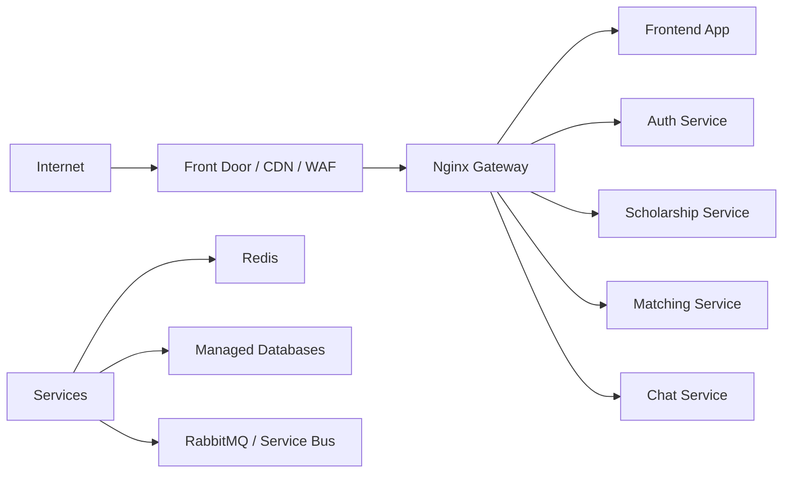

# Deployment Map

Deployment docs are split into local setup, Azure Container Apps, CI/CD, and
operational maintenance.

## Deployment Pages

| Topic | Page |
| --- | --- |
| Local and cloud deployment | [Local And Cloud Deployment](../07-deployment.md) |
| Azure Container Apps guide | [Cloud Deployment Guide](../CLOUD_DEPLOYMENT_GUIDE.md) |
| Cloud maintenance runbook | [Cloud Maintenance Runbook](../CLOUD_DEPLOYMENT_MAINTENANCE_RUNBOOK.md) |
| Deploy controls | [Deploy Control Runbook](../DEPLOY_CONTROL_RUNBOOK.md) |

## Target Cloud Shape

Production should not expose backend services directly to the internet unless
there is a clear operational reason. Gateway and frontend are the public surface.

## Production Hardening Checklist

- `minReplicas >= 2` for public-facing apps.
- Managed DB backups enabled.
- Redis reachable from services.
- RabbitMQ workers separated from API containers.
- Gateway rate limits tuned from real load-test data.
- Smoke tests run after every deploy.
- Rollback path documented and rehearsed.
