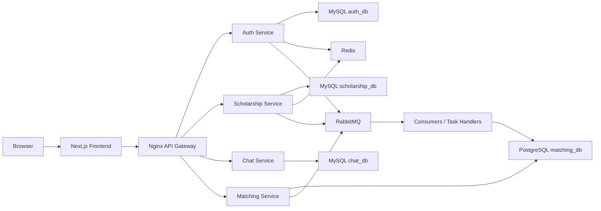

# EduMatch Documentation

EduMatch is a cloud-oriented scholarship discovery and application platform.
The project is intentionally larger than a CRUD demo: it includes a frontend,
multiple backend services, an API gateway, async workers, cache, messaging,
matching/recommendations, and deployment runbooks.

## System At A Glance

## What To Read First

| Goal | Start Here |
| --- | --- |
| Understand what docs matter | [Documentation Inventory](DOCS_INVENTORY.md) |
| Run the app locally | [Local Setup](getting-started/local-setup.md) |
| Understand the architecture | [Architecture Map](architecture/index.md) |
| Understand matching | [Matching Design](04-matching-design.md) |
| Deploy to cloud | [Deployment Map](deployment/index.md) |
| Debug production-like issues | [Operations Map](operations/index.md) |
| Analyze performance | [Performance Map](performance/index.md) |

## Engineering Themes

- Keep public reads fast with pagination, indexes, cache, and gateway limits.
- Keep matching deterministic first: hard filters and rule scores before AI.
- Push slow side effects to RabbitMQ workers.
- Treat docs as operational assets, not afterthoughts.
- Measure with p50, p95, p99, cache hit rate, queue lag, and DB query plans.

## Documentation Convention

Markdown files are the source of truth. This site is generated from those files
with MkDocs Material, so the docs can be browsed as HTML without hand-writing
HTML pages.
