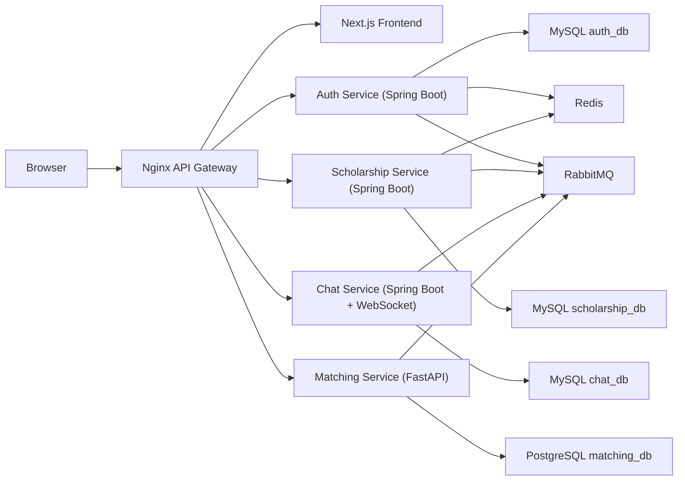
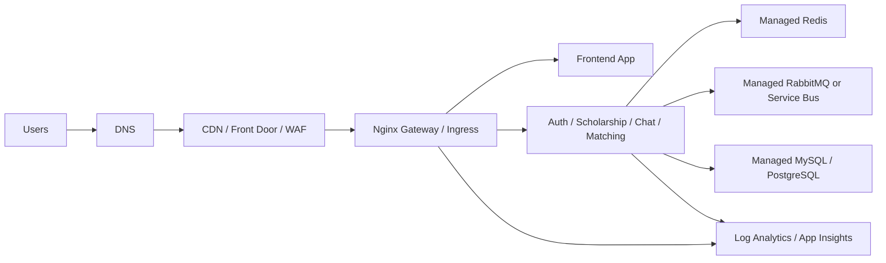
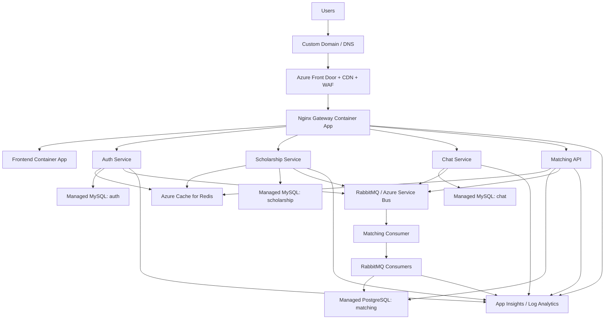

# Cloud From Zero To Production With EduMatch

This document teaches cloud engineering from beginner level to production-ready
thinking by using EduMatch as the running example.

The goal is not to memorize cloud product names. The goal is to understand what
problem each cloud component solves, where it sits in EduMatch, what can break,
how to scale it, and how to explain it professionally.

## 1. Mental Model

Cloud is not magic hosting.

Cloud is a set of managed building blocks for running software without owning
physical servers:

| Problem | Cloud answer |
| --- | --- |
| Where does code run? | Compute: containers, VMs, serverless |
| How do users reach the app? | DNS, CDN, load balancer, ingress, gateway |
| Where is data stored? | Managed DB, object storage, cache |
| How do services communicate? | HTTP, message queue, event bus |
| How does the system survive traffic spikes? | Autoscaling, caching, queueing, rate limiting |
| How do we deploy safely? | CI/CD, revisions, rollback |
| How do we know it is healthy? | Logs, metrics, traces, alerts |
| How do we avoid leaking secrets? | Secret manager, managed identity, private network |

For EduMatch, cloud means taking the local Docker Compose system and running it
as a real public platform with controlled traffic, persistent data, observability,
and scaling.

Local development today:



Cloud target:



The important shift:

Local Docker Compose proves the system can run.
Cloud proves the system can survive real users, failures, deployments, and cost.

## 2. EduMatch Current Cloud Shape

The repository already has a cloud direction:

| Area | Current project evidence |
| --- | --- |
| Runtime | `infra/azure/container-apps.bicep` provisions Azure Container Apps |
| Gateway | `nginx-gateway/nginx.prod.conf` routes traffic and rate-limits APIs |
| Frontend | `frontend` container runs Next.js |
| Backend | Java Spring Boot services and Python FastAPI matching service |
| Cache | Redis exists locally and in env contracts |
| Queue | RabbitMQ exists for events and workers |
| Observability | Application Insights connection string and OTEL service names exist |
| Docs | MkDocs now holds architecture, runbooks, performance guides |

Current weak point in `infra/azure/container-apps.bicep`:

```yaml
minReplicas: 0
maxReplicas: 2
concurrentRequests: "80"
```

This is fine for cheap staging. It is weak for serious public traffic because:

- `minReplicas: 0` allows cold starts.
- `maxReplicas: 2` caps burst capacity.
- `concurrentRequests: 80` only says when to scale HTTP containers; it does not
  guarantee DB, Redis, queue, or app code can keep up.
- There is no dedicated edge layer such as CDN, Front Door, or WAF in front of
  the gateway.

Professional framing:

EduMatch is no longer "can it deploy?".
The next question is "what SLO can it meet under load, and which layer fails
first?".

## 3. Level 0: What Happens When A User Opens EduMatch?

Think from the browser inward.

```text
User browser
  -> DNS resolves domain
  -> Edge receives request
  -> Gateway routes path
  -> Service handles business logic
  -> Cache/DB/Queue may be used
  -> Response goes back
```

Example: public scholarship list.

```text
GET /api/scholarships?page=1&country=VN
  -> gateway applies API rate limit
  -> scholarship-service validates query
  -> Redis may return cached page
  -> if cache miss, MySQL query runs
  -> response returns to frontend
```

Example: user asks for recommendations.

```text
GET /api/v1/recommendations
  -> gateway applies stricter ML/matching rate limit
  -> matching-service loads user profile and scholarship candidates
  -> matching cache may return precomputed results
  -> if cache miss, scorer calculates matches
  -> response returns with scores/reasons
```

Example: user updates profile.

```text
PATCH /api/auth/user/profile
  -> auth-service saves profile
  -> auth-service publishes user.profile.updated to RabbitMQ
  -> matching consumer receives event
  -> worker precomputes matches
  -> matching cache/table becomes warm for later reads
```

Beginner cloud lesson:

Every user request is a chain. The slowest or most overloaded link becomes the
bottleneck.

## 4. Level 1: Compute

Compute is where code runs.

In EduMatch:

| Component | Runtime type |
| --- | --- |
| `frontend-app` | container running Next.js |
| `nginx-gateway` | container running Nginx |
| `auth-service` | container running Spring Boot |
| `scholarship-service` | container running Spring Boot |
| `chat-service` | container running Spring Boot and WebSocket |
| `matching-service` | container running FastAPI/Uvicorn |
| `matching-consumer` | background process consuming RabbitMQ events |

Local Docker Compose runs these together on one machine.
Cloud Container Apps runs them as separate scalable apps.

### Why Containers Matter

A container packages:

- app code
- runtime
- OS-level dependencies
- startup command
- environment variables

This gives the same app shape across local, staging, and production.

For EduMatch:

- Java services have their own Dockerfiles.
- Matching service has its own Python Dockerfile.
- Frontend has its own Dockerfile.
- Nginx gateway uses an Nginx image plus config file.

### Beginner Mistake

"I deployed containers, so I have production."

No.

Production also needs:

- persistent managed DBs
- managed Redis or equivalent cache
- managed queue or durable RabbitMQ
- public entrypoint with TLS
- secret management
- logging and alerts
- scaling rules
- backup and restore
- rollback plan

## 5. Level 2: Networking

Networking decides who can talk to whom.

In local Docker Compose:

```yaml
networks:
  test-network:
    driver: bridge
```

Containers use service names:

```text
auth-service -> auth-db:3306
scholarship-service -> redis:6379
matching-service -> rabbitmq:5672
api-gateway -> matching-service:8000
```

In cloud, the same idea exists but with stricter security:

| Local concept | Cloud equivalent |
| --- | --- |
| Docker bridge network | Container Apps Environment / VNet |
| service name DNS | internal service discovery |
| exposed port | ingress |
| localhost port mapping | public endpoint / private endpoint |
| `.env` | secret store / app settings |

### Public vs Private

EduMatch should eventually expose only the edge/gateway publicly.

Public:

- frontend domain
- gateway/API domain

Private:

- auth-service
- scholarship-service
- chat-service
- matching-service
- databases
- Redis
- RabbitMQ

The current Bicep has:

```bicep
param exposeBackends bool = true
```

This is convenient for staging smoke tests. For production hardening, set backend
services private and route through gateway.

Professional target:

```text
Internet
  -> Front Door/WAF
  -> gateway
  -> private services
  -> private DB/cache/queue
```

## 6. Level 3: Load Balancer, Gateway, CDN, WAF

These terms are related but not identical.

| Layer | Job |
| --- | --- |
| DNS | Converts domain name to an endpoint |
| CDN | Caches static/public responses near users |
| WAF | Blocks common attacks before they reach app |
| Load balancer | Spreads traffic across replicas |
| Ingress | Lets external traffic enter container platform |
| API gateway | Routes API paths, handles CORS/rate limit/timeouts |

EduMatch currently has Nginx as API gateway.

`nginx-gateway/nginx.prod.conf` already handles:

- path routing
- CORS allowlist
- rate limit zones
- request IDs
- upstream timeouts
- WebSocket upgrade for chat
- security headers

Example rate limit zones:

```nginx
limit_req_zone $binary_remote_addr zone=auth_limit:10m rate=10r/s;
limit_req_zone $binary_remote_addr zone=api_limit:10m rate=100r/s;
limit_req_zone $binary_remote_addr zone=ml_limit:10m rate=5r/s;
```

That is useful, but gateway rate limiting is not the whole protection story.

For a serious cloud setup, put an edge layer before Nginx:

```text
User
  -> CDN / Front Door / WAF
  -> Nginx gateway
  -> service
```

Why?

- Static frontend assets should not always hit Next.js.
- Public scholarship list can be cached at edge if response is public.
- WAF blocks obvious malicious traffic early.
- Edge absorbs geographic latency better than a single backend region.
- Gateway should focus on app routing, not absorbing the entire internet.

### 3k Users Click In One Second

This is a burst, not a normal average load.

If 3,000 users hit the same public list endpoint in one second:

Bad shape:

```text
3000 requests
  -> gateway
  -> scholarship-service
  -> 3000 DB queries
```

Better shape:

```text
3000 requests
  -> CDN returns cached public response for many users
  -> Redis returns cached response for remaining requests
  -> request coalescing allows only 1 DB query per cache key
```

The professional answer is not "add more replicas" first.

The professional answer is:

1. Serve public/cacheable traffic from CDN or Redis.
2. Coalesce identical cache misses.
3. Rate-limit expensive endpoints.
4. Autoscale stateless services.
5. Protect DB connection pools.
6. Benchmark and tune with p50/p95/p99.

## 7. Level 4: Databases

Databases are usually the real bottleneck.

EduMatch has multiple DB ownership boundaries:

| Service | DB |
| --- | --- |
| Auth Service | MySQL `auth_db` |
| Scholarship Service | MySQL `scholarship_db` |
| Chat Service | MySQL `chat_db` |
| Matching Service | PostgreSQL `matching_db` |

This is a microservice-style split. Each service owns its data.

### Why DBs Bottleneck

DBs bottleneck because:

- indexes are missing or wrong
- queries scan too many rows
- connection pool is too small or too large
- every service replica opens more DB connections
- traffic spike creates too many concurrent queries
- cache miss storm overloads DB
- slow transactions hold locks

Adding app replicas can make DB problems worse.

Example:

```text
2 scholarship-service replicas x pool 20 = 40 possible DB connections
10 scholarship-service replicas x pool 20 = 200 possible DB connections
```

If MySQL cannot handle 200 active connections with real queries, scaling app
containers will just move the failure to DB.

### What To Watch

For each DB:

- CPU
- memory
- active connections
- slow queries
- lock wait time
- index usage
- p95 query latency
- backup status
- disk growth

### EduMatch DB Rule

Every hot endpoint needs an answer to this:

```text
Which query runs?
Which index supports it?
How many rows can it scan at 10k, 100k, 1M records?
What is the cache strategy?
```

For public scholarship list:

- filter fields need indexes
- sorting needs index strategy
- pagination should avoid deep offset pain at large data
- Redis/CDN should absorb repeated reads

For matching:

- precompute should avoid full scans
- score cache should be version-aware
- candidate selection should narrow rows before scoring

## 8. Level 5: Cache

Cache stores data that is expensive to recompute or fetch repeatedly.

EduMatch already has Redis in Docker Compose.

Good Redis targets:

| Use case | Good cache? | Why |
| --- | --- | --- |
| public scholarship list | yes | many users ask same pages |
| scholarship detail | yes | repeated public reads |
| auth user lookup | yes | repeated identity checks |
| provider/admin analytics | yes with short TTL | aggregate queries can be heavy |
| matching recommendations | yes with version key | expensive scoring |
| chat messages | usually no as source of truth | must persist in DB |

### Cache Hit vs Cache Miss

```text
cache hit:
request -> Redis -> response

cache miss:
request -> Redis miss -> DB query -> Redis set -> response
```

The danger is cache stampede:

```text
3000 requests for same page
  -> all miss Redis
  -> all query DB at the same time
```

Fix with request coalescing:

```text
first request gets Redis lock
other requests wait briefly or serve stale value
first request queries DB once
first request fills cache
others read cache
```

Professional cache design needs:

- deterministic cache keys
- TTL
- invalidation rules
- stale fallback for public reads
- metrics: hit rate, miss rate, lock wait, stale served
- safe fallback when Redis is down

EduMatch target:

```text
public scholarship list cache hit rate >= 80% after warmup
recommendation cache hit rate high for returning users
Redis failure degrades performance but does not kill core app
```

## 9. Level 6: Queue And Workers

Queues protect user-facing requests by moving slow side effects to the
background.

EduMatch uses RabbitMQ for:

- profile update events
- scholarship create/update events
- application notification events
- matching precompute triggers
- chat/notification delivery flows

Without queue:

```text
request waits for DB save + matching recalculation + notification delivery
```

With queue:

```text
request saves DB and publishes event
worker handles matching/notification later
```

This improves perceived latency and isolates failures.

### Queue Concepts

| Concept | Meaning |
| --- | --- |
| producer | service that publishes event |
| exchange/topic | routing layer |
| queue | durable buffer of messages |
| consumer | process that reads messages |
| worker | process that performs background job |
| retry | run failed message again |
| dead-letter queue | place for messages that keep failing |
| idempotency | duplicate messages do not corrupt data |

### EduMatch Worker Risk

The matching worker has had full-scan patterns such as loading too much data at
once. That is acceptable for small data and dangerous for 100k+ records.

Better worker shape:

```text
event says user/profile/scholarship changed
  -> identify affected subset
  -> process in chunks
  -> upsert version-aware cache rows
  -> record progress
  -> retry failed chunks safely
```

Queue does not remove work.
Queue controls when and how work happens.

## 10. Level 7: Autoscaling

Autoscaling adds or removes replicas based on load.

EduMatch Bicep uses HTTP scale:

```bicep
scale: {
  minReplicas: app.minReplicas
  maxReplicas: app.maxReplicas
  rules: [
    {
      name: 'http-scale'
      http: {
        metadata: {
          concurrentRequests: '80'
        }
      }
    }
  ]
}
```

Meaning:

If concurrent HTTP requests per replica grows beyond the target, Container Apps
can add replicas up to `maxReplicas`.

But autoscaling has limits:

- it is not instant
- cold starts can hurt p95/p99
- app replicas increase DB/cache/queue connections
- WebSocket scaling needs special care
- background workers need queue-depth scaling, not HTTP scaling

### Better EduMatch Scaling Policy

For staging:

```text
minReplicas: 0 or 1
maxReplicas: 2
```

For public demo:

```text
gateway minReplicas: 1 or 2
frontend minReplicas: 1
auth/scholarship/matching minReplicas: 1
chat minReplicas: 1
maxReplicas: 5-10 depending on DB capacity
```

For serious benchmark:

```text
gateway maxReplicas: 10+
scholarship maxReplicas: 10+
matching maxReplicas: tuned by CPU and DB
workers scaled by queue depth
DB/cache/queue sized before app maxReplicas grows
```

### Capacity Formula

Rough thinking:

```text
service_capacity_rps = replicas * safe_rps_per_replica
```

But safe RPS must come from benchmark.

Example:

```text
1 scholarship replica handles 120 RPS at p95 < 300ms
5 replicas may not equal 600 RPS if DB saturates at 350 RPS
```

So the true capacity is:

```text
min(edge_capacity, gateway_capacity, service_capacity, db_capacity, cache_capacity, queue_capacity)
```

The lowest number wins.

## 11. Level 8: Deployment

Deployment is how code moves from Git to running cloud.

Professional deployment pipeline:

```text
git push
  -> CI tests
  -> build container image
  -> scan image
  -> push to registry
  -> deploy new revision
  -> smoke test
  -> shift traffic
  -> monitor
  -> rollback if needed
```

EduMatch already has direction toward:

- Azure Container Registry
- Container Apps revisions
- GitHub Actions docs deploy
- bootstrap image for initial Container App creation
- app version and git commit env values

Important deployment concepts:

| Concept | Meaning |
| --- | --- |
| image tag | version of container image |
| registry | place that stores images |
| revision | immutable deployed version |
| blue/green | old and new versions run separately |
| canary | small traffic percentage goes to new version |
| rollback | return to previous healthy version |
| smoke test | small post-deploy health check |

### EduMatch Smoke Tests

After deploy, verify:

```text
GET /gateway/health
GET /api/auth/health
GET /debug/health
GET /health
login flow
public scholarship list
matching recommendation endpoint
chat websocket connect
```

Do not call a deployment "done" only because the container started.
Call it done when user flows work and metrics look healthy.

## 12. Level 9: Secrets And Configuration

Secrets are sensitive values:

- DB password
- JWT secret
- RabbitMQ password
- Redis password
- Application Insights connection string
- email password
- OAuth credentials

Local uses `.env`.

Cloud should use:

- platform secrets
- key vault
- managed identity when possible
- environment-specific config

Bad:

```text
commit password into Git
reuse staging secret in production
print secret in logs
put secret in frontend env var
```

Good:

```text
service reads secret at runtime
secret rotation is possible
frontend only gets public config
prod and staging secrets are separated
logs redact sensitive values
```

EduMatch examples:

- `EDUMATCH_JWT_SECRET` must be strong and private.
- DB passwords must not live in committed docs.
- `NEXT_PUBLIC_*` values are visible to browser users, so do not put secrets
  there.

## 13. Level 10: Observability

Observability means you can answer:

```text
Is the system healthy?
Where is it slow?
What changed?
Who is affected?
Which dependency failed?
```

The three pillars:

| Pillar | What it answers |
| --- | --- |
| Logs | What happened in this request/job? |
| Metrics | How often, how slow, how many errors? |
| Traces | Which services did one request pass through? |

EduMatch already has:

- structured Nginx gateway logs
- `X-Request-Id`
- `traceparent` forwarding
- `OTEL_SERVICE_NAME`
- Application Insights connection string config
- matching service Prometheus metrics endpoint

### Minimum Production Dashboard

Track these per service:

- request rate
- p50/p95/p99 latency
- 4xx rate
- 5xx rate
- CPU
- memory
- restarts
- DB query latency
- DB active connections
- Redis hit rate
- Redis latency
- RabbitMQ queue depth
- worker success/failure count
- WebSocket active connections

### Alerts That Matter

Start with:

```text
5xx rate > 2% for 5 minutes
p95 latency > SLO for 10 minutes
container restarts > normal
DB CPU high
DB connections near limit
RabbitMQ queue depth increasing
Redis unavailable
disk/storage nearing limit
```

Do not alert on everything.
Alert when a human needs to act.

## 14. Level 11: Reliability

Reliability is about surviving failure.

Assume things fail:

- service crashes
- DB is slow
- Redis goes down
- RabbitMQ has backlog
- one deploy is bad
- one region has trouble
- traffic spikes suddenly

EduMatch reliability design:

| Failure | Expected behavior |
| --- | --- |
| matching-service down | scholarship browsing still works |
| Redis down | app falls back to DB with rate limit and logs |
| RabbitMQ down | critical DB writes still persist; events retry/outbox |
| worker down | user request still succeeds; precompute catches up later |
| chat-service down | matching and browsing still work |
| DB down | service returns clear 503 and alerts |

### SLO Thinking

SLO means Service Level Objective.

Example EduMatch SLOs:

```text
Public scholarship list:
  99% requests succeed
  p95 latency < 500ms

Login:
  99% requests succeed
  p95 latency < 800ms

Matching recommendation:
  99% requests succeed after warm cache
  p95 latency < 1000ms

Profile update:
  user-facing write p95 < 800ms
  matching precompute completes within 5 minutes
```

SLOs force you to separate sync and async work.

## 15. Level 12: Security

Cloud security is layered.

EduMatch security layers:

| Layer | Example |
| --- | --- |
| edge | WAF, TLS, bot/rate protection |
| gateway | CORS allowlist, route-level rate limit, security headers |
| service | auth, authorization, validation |
| data | DB credentials, row ownership, backups |
| network | private services and private dependencies |
| deployment | CI permissions, image provenance |
| observability | audit logs and security alerts |

Important distinction:

CORS is not authentication.
Rate limiting is not authorization.
WAF is not validation.

You still need all of them.

### EduMatch Security Checklist

- only gateway/frontend public
- backend services private
- TLS everywhere public
- strong JWT secret
- token expiry and refresh policy
- role checks for admin/provider/user APIs
- input validation on all write endpoints
- upload file size/type validation
- secrets never committed
- production CORS allowlist uses real domains only
- admin endpoints have stricter rate limits and audit logs

## 16. Level 13: Cost

Cloud engineering includes cost control.

Common cost drivers:

- always-on replicas
- DB size and tier
- logs volume
- egress traffic
- CDN traffic
- queue throughput
- cache tier
- container CPU/memory
- build minutes

Cheap staging:

```text
minReplicas: 0
small DB tiers
short log retention
manual scale
```

Public demo:

```text
minReplicas: 1 for gateway/frontend/core APIs
small but reliable DB
Redis sized for cache
alerts on cost spikes
```

Production:

```text
right-sized DB
autoscale with limits
cache hot reads
edge caching for static/public content
retention policy for logs
budget alerts
```

Professional answer:

You do not blindly maximize replicas. You choose a target SLO and cost envelope,
then tune.

## 17. Level 14: Benchmarking

Benchmarking proves capacity.

Without benchmark:

```text
"I think it scales."
```

With benchmark:

```text
"With 100k scholarship records and warm Redis cache, public list handles X RPS
at p95 Y ms and error rate Z%. The bottleneck is DB CPU after N RPS."
```

EduMatch benchmark scenarios:

| Scenario | Why it matters |
| --- | --- |
| public scholarship list | hottest public read |
| scholarship detail | common repeated read |
| login | auth critical path |
| matching batch scores | expensive personalized read |
| recommendations | matching cache and scorer path |
| profile update | event publish and precompute path |
| worker precompute | async backlog capacity |
| chat WebSocket connect | realtime capacity |

Metrics to report:

- dataset size: 10k / 100k / 1M records
- concurrent users
- RPS
- p50 latency
- p95 latency
- p99 latency
- error rate
- DB CPU
- DB connection count
- Redis hit rate
- RabbitMQ queue depth
- container CPU/memory
- replica count over time

### Burst Test: 3k Users In One Second

This test should be split:

| Test | Meaning |
| --- | --- |
| cold cache burst | worst case; shows DB/cache stampede risk |
| warm cache burst | expected public traffic shape after cache warmup |
| authenticated burst | harder because responses differ per user |
| matching burst | expensive path; should use cache/precompute |

Expected design:

```text
public read burst:
  CDN/Redis absorbs most requests

authenticated read burst:
  Redis and DB indexes matter

matching burst:
  precomputed cache, rate limit, async workers

write burst:
  idempotency, DB transaction limits, queue buffering
```

Do not promise "3k users in one second" until the benchmark says so.
You can design for it, but the number must be measured.

## 18. Beginner To Professional Roadmap

### Stage A: Cloud Beginner

You should be able to explain:

- what a container is
- why Docker Compose is not production
- what a database, cache, and queue do
- what a gateway does
- what environment variables are
- what a health check is
- how a request flows through EduMatch

Practice in EduMatch:

- run Docker Compose
- hit gateway health
- open RabbitMQ UI
- inspect Redis keys
- read Nginx route for one endpoint
- read one service DB config

### Stage B: Junior Cloud-Ready Backend

You should be able to:

- deploy containers to staging
- read logs for a failing service
- understand service-to-service URLs
- separate public and private services
- configure secrets safely
- create smoke tests
- explain DB connection pool impact
- understand cache TTL and invalidation

Practice in EduMatch:

- explain why gateway should be public but auth-service private
- explain why `minReplicas: 0` causes cold start
- explain why `maxReplicas: 2` caps burst traffic
- explain what happens if Redis is down
- explain what happens if RabbitMQ backlog grows

### Stage C: Mid-Level Production Engineer

You should be able to:

- design autoscale rules per service
- benchmark p50/p95/p99
- identify bottlenecks from metrics
- add Redis cache and request coalescing
- tune DB indexes and query plans
- add DLQ/retry/idempotency for workers
- design zero-downtime deploy/rollback
- write runbooks

Practice in EduMatch:

- benchmark public scholarship list with 10k/100k records
- fix matching worker full-scan behavior
- make matching cache version-aware
- move repeated public reads to Redis/CDN
- define SLOs for each critical endpoint

### Stage D: Senior/Professional Cloud Engineer

You should be able to:

- design complete cloud architecture
- reason about cost, latency, reliability, and security tradeoffs
- choose managed services intentionally
- plan multi-region or disaster recovery when needed
- design incident response
- design observability that leads to action
- communicate capacity with measured evidence

Practice in EduMatch:

- draw target architecture with edge, private network, managed DB/cache/queue
- produce benchmark report with bottleneck conclusion
- create production readiness checklist
- define rollback strategy
- define failure modes and degradation behavior
- justify which services scale independently

## 19. EduMatch Target Architecture

Recommended next production architecture:



Production intent:

- Edge handles TLS, CDN, WAF, geographic entry.
- Gateway handles app routing, request IDs, CORS, coarse rate limits.
- Backend services are private.
- DB/cache/queue are private managed dependencies.
- Public reads are cached.
- Expensive matching is precomputed and versioned.
- Workers scale by queue depth.
- Every critical path has metrics and alerts.

## 20. What To Improve Next In EduMatch

Priority order:

1. Benchmark with 10k and 100k records.
2. Add Redis cache and request coalescing for public scholarship list.
3. Fix matching worker full scans with chunking and affected-subset processing.
4. Make matching cache unique/upsert/version-aware.
5. Change public demo scale from `minReplicas: 0` to at least `1` for gateway,
   frontend, auth, scholarship, matching, chat.
6. Increase `maxReplicas` only after DB/cache/queue capacity is planned.
7. Add Front Door/CDN/WAF before gateway.
8. Make backend Container Apps private behind gateway.
9. Add dashboards for p95/p99, errors, DB connections, Redis hit rate, RabbitMQ
   queue depth, worker failures.
10. Add rollback and smoke-test checklist to deployment pipeline.

This order matters.

Do not start by buying a bigger cloud setup.
Start by making hot traffic cacheable, measurable, and bounded.

## 21. Interview-Ready Explanation

Short version:

```text
EduMatch is a cloud-native scholarship matching platform built with a Next.js
frontend, Nginx API gateway, Spring Boot microservices, a FastAPI matching
service, Redis, RabbitMQ, MySQL, and PostgreSQL. Locally it runs on Docker
Compose; the cloud direction uses Azure Container Apps with Container Registry,
Log Analytics, and Application Insights.

The current staging setup proves deployability, but production scale requires
stronger edge protection, cache strategy, autoscaling policy, benchmark evidence,
and private networking. The biggest risks are cold starts from minReplicas=0,
burst limits from maxReplicas=2, uncached hot public reads, matching worker
full scans, and DB saturation under concurrent traffic.

My hardening plan is to benchmark 10k/100k data with p50/p95/p99, add Redis and
request coalescing for public reads, make matching cache version-aware, scale
workers by queue depth, put Front Door/CDN/WAF before the gateway, keep backends
private, and build dashboards for latency, error rate, DB connections, cache hit
rate, and queue depth.
```

Professional one-liner:

```text
I do not treat cloud as just deployment. I treat it as runtime, networking,
data, scaling, reliability, security, observability, cost, and measurable SLOs.
```

## 22. How To Study This Project

Read in this order:

1. `docs/00-overview.md`
2. `docs/01-system-architecture.md`
3. `docs/06-data-flow.md`
4. `docs/07-deployment.md`
5. `docs/learning/cloud-from-zero-to-production.md`
6. `docs/learning/production-hardening/index.md`
7. `docs/learning/production-hardening/benchmark-10k-100k.md`
8. `docs/learning/production-hardening/cloud-replicas-autoscale.md`
9. `docs/learning/production-hardening/redis-public-cache-coalescing.md`
10. `docs/learning/production-hardening/matching-worker-full-scan.md`

Then inspect real code:

1. `docker-compose.yml`
2. `infra/azure/container-apps.bicep`
3. `nginx-gateway/nginx.prod.conf`
4. `matching-service/app/service.py`
5. `matching-service/app/workers.py`
6. Java service cache and RabbitMQ configs

Study loop:

```text
read doc
  -> find matching config/code
  -> run locally
  -> observe logs
  -> change one setting
  -> benchmark
  -> write conclusion
```

That loop is how cloud knowledge becomes real skill.

